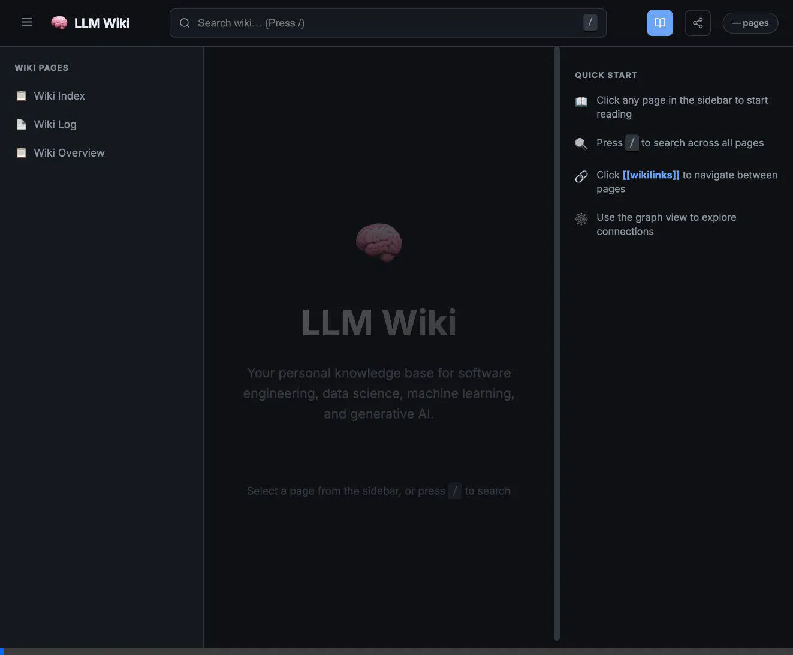

# 🧠 LLM Wiki — The Self-Maintaining Knowledge Base

A next-generation personal knowledge base covering **software engineering, cloud infrastructure, data science, machine learning, and AI**. Built on the principle of **Automated Ingestion and Human Curation**.



## ✨ Core Features

- **🧠 "Ask the Wiki" (RAG)**: A built-in AI assistant that performs semantic search over your notes and responds using context-aware Retrieval Augmented Generation.
- **🚀 Autonomic Ingestion**: Simply drop notes into the inbox (supports **Markdown, PDF, Text, HTML**); the AI autonomously classifies, archives, and cross-links them into the wiki.
- **🌐 Interactive Graph**: Visualize connections between knowledge domains with a real-time BFS/DFS graph explorer.
- **🔍 Global Instant Search**: Millisecond-fast search across all categories and raw sources.
- **🎨 Premium Aesthetics**: Glassmorphic UI with dark mode support, fluid animations, and a modern design system.

---

## 🏗️ Architecture

- **Backend**: Zero-external-dependency Python server (`http.server` + `urllib`).
- **AI Engine**: Multi-provider support for **Google Gemini** (default) and **Ollama** (offline fallback).
- **Frontend**: Vanilla JavaScript and CSS transitions for a lightweight, high-performance experience.
- **Structure**:
    - `raw/`: Immutable source documents (LLM read-only).
    - `wiki/`: AI-generated and maintained summaries.
    - `tests/`: 25+ automated unit tests covering RAG, API, and core logic.

---

## 🚀 Quick Start

### 1. Setup Environment
Create a `.env` file in the project root:
```bash
GOOGLE_API_KEY=your_gemini_key
```

### 2. Launch the Web UI
Using **uv** (recommended):
```bash
uv sync
uv run python3 ui/wiki_server.py
```

Or using standard python:
```bash
python3 ui/wiki_server.py
```
Access the dashboard at: [http://localhost:3737](http://localhost:3737)

### 3. Run the Test Suite
Ensure the RAG engine and API are healthy:
```bash
python3 -m unittest discover tests
```

---

## 💡 Workflow: The "Inbox" Pattern

This project follows a streamlined ingestion workflow:

1.  **COLLECT**: Drop any note (**Markdown, Text, HTML, RTF**) into `raw/inbox/`.
2.  **PROCESS**: Tell your LLM developer (Antigravity): `Ingest inbox`. 
    - *Tip: For historical notes, you can specify a date: `Ingest inbox with date 2022-01-01`.*
3.  **MANAGE**: Use the **`+` (New Page)** button in the sidebar or the **Edit** button on any page to update your wiki directly from the browser.
4.  **QUERY**: Use the built-in "Ask AI" drawer to query your entire knowledge base in natural language.

---

## 🧪 Knowledge Domains
The wiki is structured to automatically handle:
- **Infrastructure**: AWS Services, S3, Cloud-native patterns.
- **DevOps**: Docker, CI/CD, Containerization.
- **Programming**: Python (OOP, Regex, Async), JavaScript, Web Scraping.
- **Math & Data**: Statistics, Probability, ML Pipelines, Deep Learning.
- **AI**: LLM Concepts, Prompt Engineering, RAG Architectures.

---

- **📋 Meta-Management**: 
    - **Confidence Scoring**: Every page includes a `confidence` rating (0.0–1.0) based on source coverage.
    - **📅 Chrono-Accuracy**: Support for historical backdating and automatic `mtime` fallbacks.
    - **🧹 Pruning & Archiving**:
        - **Stale Flag**: Set `stale: true` in a note's frontmatter to remove it from search, RAG, and the UI without deleting the file.
        - **Permanent Archive**: Move files to the `archive/` directory to fully decommission them while preserving history.
    - **Stale Detection**: Automated flagging of pages that haven't been updated after relevant new sources were added.
    - **Graph Metadata**: Automatic extraction of tags and categories for visualization.
