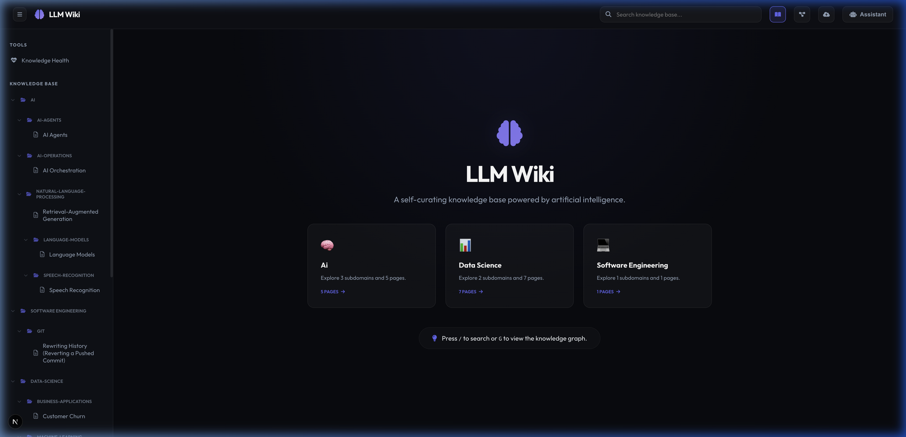
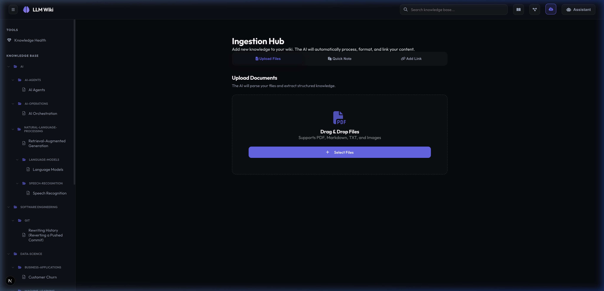
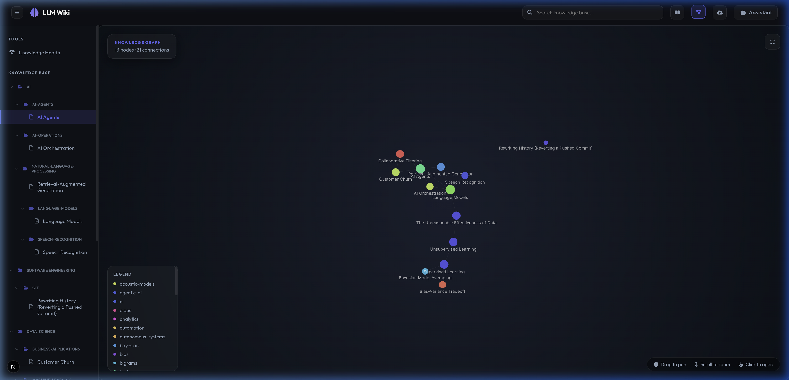
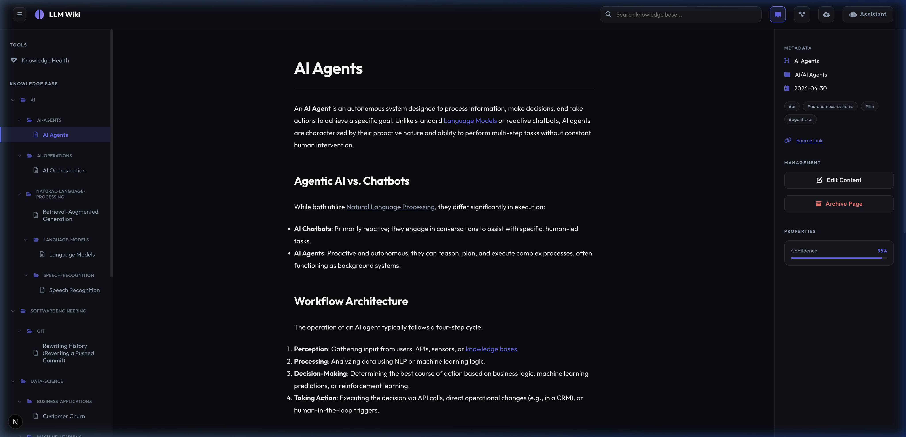

# LLM Wiki: Self-Curating Knowledge Base

LLM Wiki is a premium, AI-driven knowledge management system designed to turn raw information into a structured, semantic knowledge graph. Powered by Google's Gemini Pro, it automatically synthesizes notes, URLs, and files into a cohesive wiki with intelligent linking and automated categorization.



## ✨ Features

### 🧠 AI-Powered Ingestion Hub
Streamline your knowledge gathering with multi-method ingestion. Whether it's a quick note, a long article, or a collection of research papers, the AI engine processes and integrates it seamlessly.
- **Quick Note**: Paste text directly for immediate synthesis.
- **Link Ingestion**: Provide a URL, and the AI extracts the core knowledge while preserving the source citation.
- **Batch Upload**: Drag and drop multiple files (Markdown, Text, PDF) for bulk processing.



### 📊 Semantic Graph & Hierarchy
Visualize your knowledge. LLM Wiki builds a dynamic graph of concepts and automatically organizes them into a deep, logical domain hierarchy.
- **Dynamic Sidebar**: Reflects the real-time structure of your knowledge base.
- **Knowledge Graph**: Explore relationships between concepts visually.
- **Home Analytics**: Dashboard tiles showing subdomain and page counts for each primary domain.



### 🔗 Intelligent Linking & Meta-data
Every page is part of a larger conversation. The AI automatically generates:
- **Wikilinks**: Semantic connections to existing knowledge using `[[Title]]` syntax.
- **Provenance**: Automatic source tracking for all ingested links.
- **Rich Frontmatter**: Titles, categories, tags, last-updated dates, and AI confidence scores.



### 💎 Premium Design Language
Built for productivity and aesthetics:
- **Glassmorphic UI**: A modern, translucent interface that feels lightweight and responsive.
- **Micro-animations**: Smooth transitions and hover effects for a premium feel.
- **Real-time Console**: Watch the AI knowledge engine work in real-time.

## 🚀 Getting Started

### Prerequisites
- Node.js 18+ 
- A Google Gemini API Key

### Installation

1. **Clone the repository**:
   ```bash
   git clone https://github.com/paulang1807/llm-wiki.git
   cd llm-wiki
   ```

2. **Install dependencies**:
   ```bash
   npm install
   ```

3. **Configure environment variables**:
   Create a `.env` file in the root directory:
   ```env
   GOOGLE_API_KEY=your_gemini_api_key_here
   WIKI_DIR=./wiki
   ```

4. **Run the development server**:
   ```bash
   npm run dev
   ```

Open [http://localhost:3000](http://localhost:3000) to start building your self-curating knowledge base.

## 📺 Demonstration

Watch the AI Knowledge Engine synthesize a quick note into a structured wiki page:


---

Built with ❤️ using Next.js and Gemini Pro.
